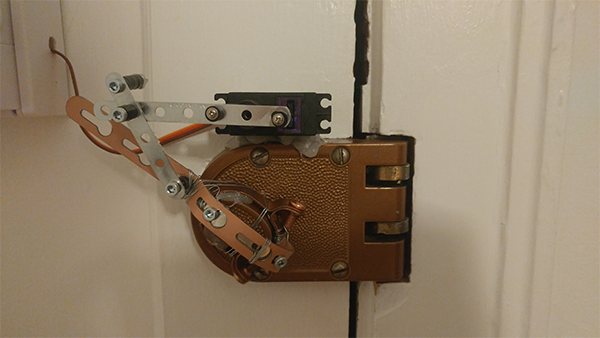
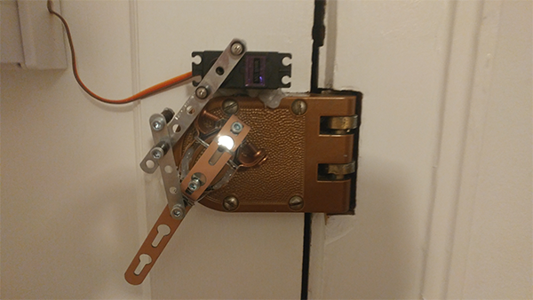

Deadbolt NFC lock control using an Arduino.

[](https://www.youtube.com/watch?v=ZtRfKeYX8ks)

# Getting Started

Follow [Adafruit's tutorial](https://learn.adafruit.com/adafruit-pn532-rfid-nfc/overview) on wiring the PN532 NFC shield to the Arduino.
Their tutorial also covers [downloading necessary libraries](https://learn.adafruit.com/adafruit-pn532-rfid-nfc/arduino-library) for programming the hardware.

Before compiling and flashing the firmware, use an example sketch from the Adafruit library to read the code from your NFC device.
Create `authorized-ids.h` and add the codes you'd like to authorize:

```c
const unsigned long int authorizedIDs[] = {
  1234567812345678, // Example NFC ID
  8765432187654321 // Example NFC ID
};
// Use one of the Adafruit example NFC sketches to read your tags' IDs
```

Using the [Arduino IDE](https://www.arduino.cc/en/Main/Software), flash [deadbolt.cpp](./deadbolt.cpp) and `authorized-ids.h` to your Arduino.

### Required Hardware

* [Arduino Uno Rev3](https://store-usa.arduino.cc/products/a000066)
* [PN532 NFC/RFID controller breakout board - v1.6](https://www.adafruit.com/products/364)
* Servo motor with strong torque (I use [this](https://www.amazon.com/gp/product/B013QUOKU6))
* A pipe bracket that can fit onto your deadbolt knob, constructor set pieces, double-sided tape, hot glue, and some creativity
* Some kind of enclosure and double-sided tape for holding the circuitry on the inside of the door (I use [this](https://www.amazon.com/gp/product/B007IUOG5A))
* A momentary pushbutton for easy locking and unlocking from inside (I use [this](https://www.adafruit.com/products/1478))
* [Particle Photon](https://store.particle.io/#photon) (optional, for web connectivity)
* One or more NFC tags

Wire the following:

Servo: 5v to 5v, ground to ground, and data to pin **9**.

Pushbutton: One end to 5v, other end to pin **7**.

LED: anode to ground and cathode to pin **13**. (optional)

# Attaching to Deadbolt knob

Here's where you'll need to get creative.
For an apartment that you lease, I recommend mounting the back of the servo to the door with a non-damaging [poster strip](https://www.amazon.com/Command-Hanging-Value-Pack-48-Strips-17024-48ES/dp/B001KYSAN4),
then securing it with hot glue between the servo and the actual metal of the deadbolt.

You'll then need affix a pipe clamp to the deadbolt knob.
Check your local hardware store for a "milford hanger" and another bracket that will fit your need.
I used a combination of the bracket tension, hot glue, and wrapped steel wire to keep the contraption steadily holding the knob.

Bridge the connection between the milford hanger and the servo, using some kind of brackets. I used constructor set pieces bought from the cheapest set I could find online.

Open deadbolt:



Closed deadbolt:



# Web connectivity (optional)

If you'd like to be able to lock and unlock the deadbolt via the web, open [deadbolt-lamprey.cpp](./deadbolt-lamprey.cpp) and change line 5 to a secure password.
Flash the firmware to your Photon board.

Wire the Photon's VIN to the Arduino's 3v pin, the Photon's pin **D1** to the Arduino's pin **7**, and ground to ground.

Follow the steps on [how to call a Particle function](https://docs.particle.io/reference/api/#call-a-function).
Using your Photon's deviceId and auth token, call the function `toggle` with your password as the argument.

# Important

With everything assembled, test that your deadbolt can still be unlocked with a normal key.
It's highly recommended that you still carry normal keys in case of power or hardware failure!
Also, you may want to leave a second door unlocked while testing, in case the servo jams and prevents unlocking the door from the outside.

# Troubleshooting

### The servo doesn't turn correctly to lock or unlock the deadbolt
You may need to adjust the servo's open and closed rotations to your setup.
To do this, modify the `LOCKED_POS` and `UNLOCKED_POS` variables in [deadbolt.cpp](./deadbolt.cpp).
